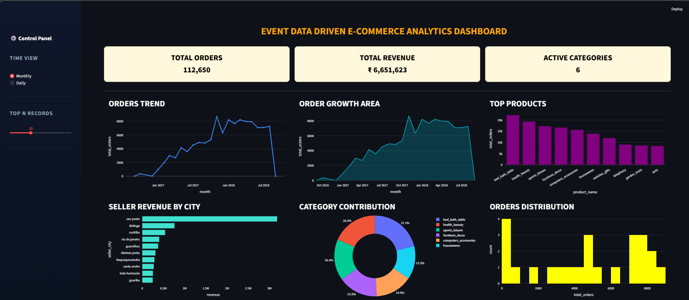
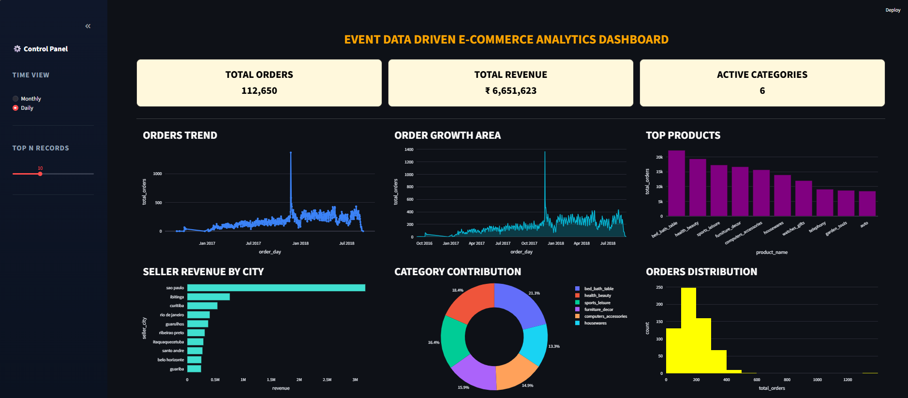

# 🚀 Event-Driven E-Commerce Data Pipeline & Analytics Platform


---

## 📌 Project Overview

This project implements a production-style event-driven e-commerce data pipeline designed to simulate modern enterprise analytics architecture.

The system generates 5,000+ user interaction events and transactional records, processes them through a structured ETL pipeline, models the data using a Star Schema (fact and dimension tables), and loads it into Google BigQuery as a cloud data warehouse.

Analytical views are created to support business intelligence reporting, exposed via FastAPI REST endpoints, and visualized through an interactive Streamlit dashboard.

The project demonstrates full ownership of the data lifecycle — from raw data ingestion to business-ready insights.

---

## 🎯 Objectives

- Build an end-to-end data engineering pipeline
- Implement event-driven architecture
- Perform ETL cleaning and validation
- Design fact and dimension tables (Star Schema)
- Integrate with cloud data warehouse (BigQuery)
- Develop REST APIs using FastAPI
- Build a professional BI-style dashboard

---

## 🏗 Architecture

### End-to-End Data Flow

Raw CSV Data  
⬇  
MySQL (Raw Tables)  
⬇  
Python ETL Processing  
⬇  
MySQL (Clean Tables)  
⬇  
Star Schema Modeling  
⬇  
Google BigQuery  
⬇  
Analytical Views  
⬇  
FastAPI (API Layer)  
⬇  
Streamlit Dashboard  

---

## ⚡ Event-Driven System

The system simulates real-world e-commerce user behavior by generating:

- page_view  
- product_view  
- add_to_cart  
- remove_from_cart  
- checkout_started  
- payment_success  
- payment_failed  
- order_cancelled  
- order_delivered  
- review_submitted  

This replicates clickstream tracking used by modern digital platforms for behavioral analytics and conversion monitoring.

---

## 📊 Data Scale & Simulation

- 5,000+ simulated user interaction events  
- 100K+ transactional order records processed  
- 10+ event types implemented  
- Star Schema modeling for analytical queries  
- Cloud-based warehouse integration (BigQuery)

The simulation mimics real-world user journeys, enabling realistic analytical reporting.

---

## 🧱 Data Modeling

### ⭐ Fact Table

**fact_orders**

Stores measurable business metrics:

- order_id
- customer_id
- product_id
- order_date
- price
- freight_value

---

### 📐 Dimension Tables

- dim_customers  
- dim_products  
- dim_sellers  
- dim_date  

Fact tables store numeric metrics.  
Dimension tables provide descriptive context.

---

## 📈 Analytical Views (BigQuery)

Business-ready views created:

- daily_orders  
- monthly_orders  
- top_products  
- seller_revenue_city  
- category_contribution  
- orders_distribution  

These views simplify reporting and improve analytical performance.

---

## 🔌 FastAPI Layer

FastAPI exposes BigQuery data through REST APIs.

### Example Endpoints

- `/daily-orders`
- `/monthly-orders`
- `/top-products`
- `/seller-city`
- `/category-contribution`

This ensures scalable, decoupled, and production-ready architecture.

---

## 📊 Streamlit Dashboard

The dashboard provides interactive business insights including:

### KPIs
- Total Orders  
- Total Revenue  
- Active Categories  
- Revenue Growth Percentage  

### Visualizations
- Order Volume Over Time (Line Chart)  
- Cumulative Order Growth (Area Chart)  
- Top Product Categories (Bar Chart)  
- Seller Revenue by City (Horizontal Bar)  
- Category Contribution (Donut Chart)  
- Order Volume Distribution (Histogram)  

### Features
- Global Time Filter (Daily / Monthly)
- Top N Filter
- Professional Dark Theme UI
- Responsive Layout

---

## 📷 Dashboard Snapshots

### Monthly View

<p align="center">
  
</p>

### Daily View

<p align="center">
  
</p>

---

## 🛠 Technology Stack

- Python  
- Pandas  
- SQL  
- MySQL  
- Google BigQuery  
- FastAPI  
- Streamlit  
- Plotly  
- SQLAlchemy  
- Faker  

---

## ⚙️ How to Run the Project

### 1️⃣ Install Dependencies

```bash
pip install -r requirements.txt
```

### 2️⃣ Start FastAPI

```bash
uvicorn main:app --reload
```

### 3️⃣ Run Streamlit Dashboard

```bash
streamlit run dashboard/app.py
```

---

## 🌍 Real-World Applications

This architecture is commonly used in:

- E-Commerce Analytics  
- Retail Data Platforms  
- Clickstream Analytics  
- SaaS Business Intelligence Systems  
- Cloud-Based Data Warehousing  

---

## 🎓 Resume Description

Built a production-style event-driven e-commerce data platform integrating MySQL, BigQuery, FastAPI, and Streamlit. Implemented ETL processing, star schema modeling, analytical views, REST APIs, and an interactive BI dashboard to simulate enterprise-level cloud analytics architecture.

---

## 📌 Project Status

✔ Completed  
✔ Cloud Integrated  
✔ Event-Driven Architecture  
✔ End-to-End Data Pipeline Implemented  

---

## 👨‍💻 Author

Developed as a Data Engineering & Business Intelligence portfolio project.
